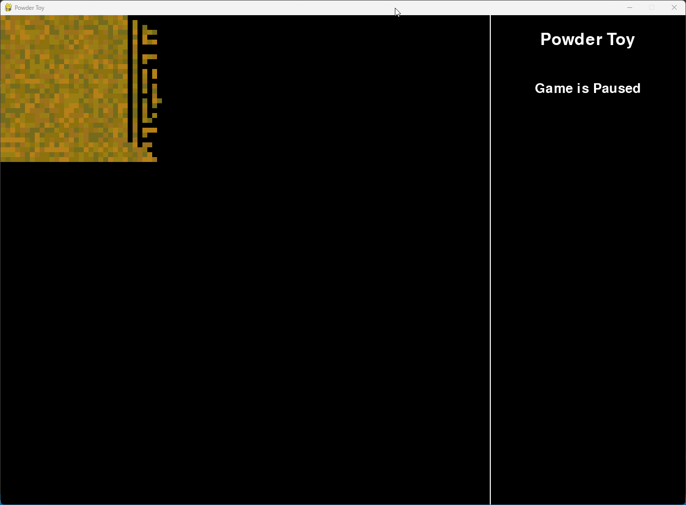
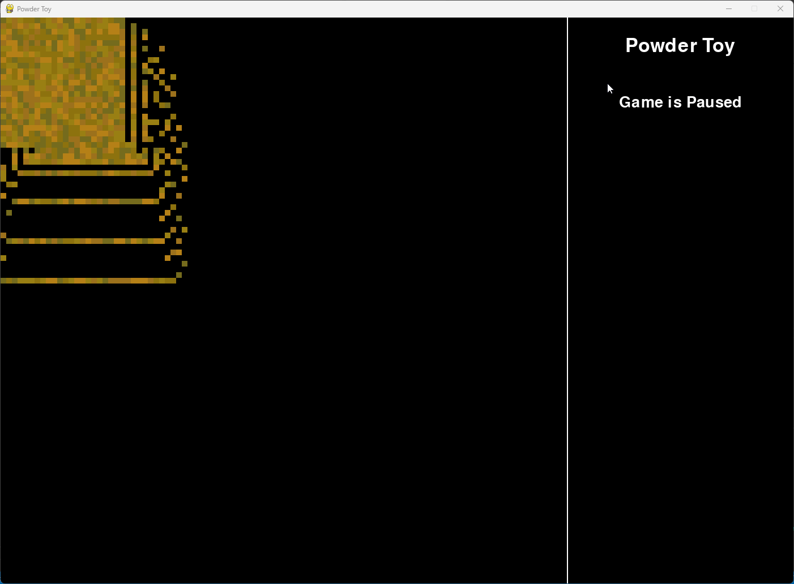
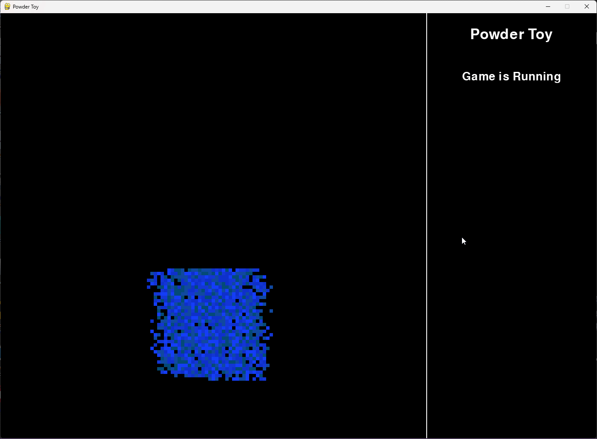
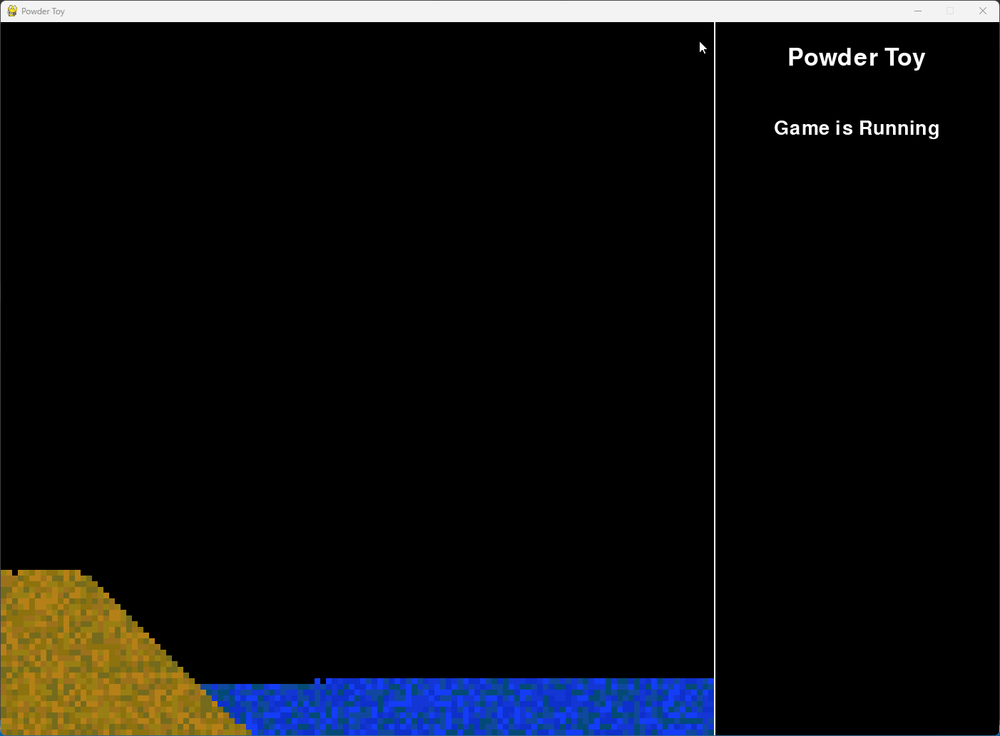

# Powder Toy Clone - A Simple Physics Simulation

---

## Overview

**Powder Toy Clone** is a basic simulation of a powder-like substance that reacts to gravity and interacts with its surroundings. Built using Python and Pygame, this project provides a sandbox environment where users can experiment with the behavior of particles and observe their interactions in real-time. This project serves as a learning tool for understanding physics simulations, particle dynamics, and game development.

This project is based on the game [Powder Toy](https://powdertoy.co.uk/)[^1], and intends to implement the basic features such as solids and liquids. This readme will be updated after each major feature addition, which will be chronicled [Development](#development).

---

## Table of Contents

1. [Features](#features)
2. [Installation](#installation)
3. [Usage](#usage)
4. [Customization](#customization)
5. [Development](#development)
    - [21/08/24 - Adding basic controls and movement](#210824---adding-basic-controls-and-movement)
    - [22/08/24 - Encapsulating functionality into classes](#220824---encapsulating-functionality-into-classes)
    - [27/08/24 - Adding water, and reworking the update system](270824---adding-water-and-reworking-the-update-system)
6. [License](#license)
7. [References](#references)

---

## Features

- **Interactive Grid:**
  - Use the mouse to draw particles on the grid.
  - Particles fall under gravity and interact with their environment.
- **Keyboard Controls:**
  - **Space:** Pause and resume the simulation.
  - **C:** Clear the entire grid.
  - **Q:** Quit the game.
- **Real-time Simulation:**
  - Observe the particles' behavior in real-time as they interact with each other and their environment.

---

## Installation

To run this project, you will need Python 3.6 or higher and the following Python packages:

- `numpy`
- `pygame`

You can install these dependencies using pip:

```sh
pip install numpy pygame
```

To start the simulation, run the following command:

```sh
python game.py
```

---

## Usage

### Playing the Game:

- The simulation starts with an empty grid. Use the keyboard shortcuts to control the game.
- Left-click to draw particles and right-click to erase them.
- The simulation applies gravity to particles, causing them to fall and interact with their surroundings.

### Keyboard Shortcuts:

- **Pause/Resume**: Press `Space` to pause and unpause the simulation.
- **Clear Grid**: Press `C` to clear all particles on the grid.
- **Quit**: Press `Q` to exit the game.

---

## Customization

You can customize various aspects of the game, such as:

- **Resolution**: Adjust the `RESOLUTION` variable to change the size of the cells.
- **Window Size**: Adjust the `WIDTH`, `HEIGHT`, and `GAMEWIDTH` variables to change the size of the window. You may also need to adjust the positions of text fields accordingly.
- **Game Speed**: Modify the `FPS` variable to change the speed of the simulation.
- **Colors**: Customize the colors of the particles in the `colours` variable.

---

## Development

### 21/08/24 - Adding basic controls and movement

Today I first began creating my version of Powder Toy. I was able to reuse code from my **Game of Life**[^2] project to get the basic window to appear, and to draw a particle to the screen. From here, I began to implement the basic movement logic for a single particle.

```python
def move_sand(y, x, roi, newGrid):
    if y < CELLS_Y - 1:
        # If can fall straight down
        if roi[2, 1] == 0:
            print(newGrid[y, x])
            print(newGrid[y+1, x])
            newGrid[y+1, x] = newGrid[y, x]
            newGrid[y, x] = 0
        # If can fall left
        elif np.array_equal(roi[2], [0, 1, 1]) and x > 0:
            newGrid[y+1, x-1] = newGrid[y, x]
            newGrid[y, x] = 0
        # If can fall right
        elif np.array_equal(roi[2], [1, 1, 0]) and x < CELLS_X - 1:
            newGrid[y+1, x+1] = newGrid[y, x]
            newGrid[y, x] = 0
        # Stochastic movement if the sand can move either left or right
        elif np.array_equal(roi[2], [0, 1, 0]):
            # If can't move left, move right
            if x == 0:
                newGrid[y+1, x+1] = newGrid[y, x]
                newGrid[y, x] = 0
            # If can't move right, move left
            elif x == CELLS_X - 1:
                newGrid[y+1, x-1] = newGrid[y, x]
                newGrid[y, x] = 0
            # Otherwise, random direction
            else:
                direction = random.randint(0, 1)
                # Move left
                if direction == 0:
                    newGrid[y+1, x-1] = newGrid[y, x]
                    newGrid[y, x] = 0
                else:
                    newGrid[y+1, x+1] = newGrid[y, x]
                    newGrid[y, x] = 0
```


The above logic checks within a 3x3 region of interest, centred on the pixel we intend to move. The row of pixels directly below the current pixel are checked, and if the row conforms to one of 4 different conditions, the particle will move, otherwise will stay in place. This logic is very simple, and so once tested I quickly moved on to adding gravity and velocity. 

To implement gravity, I added a new array in which the velocity of each cell is stored. Every iteration, the velocity is increased by the gravity value (which is 0.7), and is clamped at a maximum velocity of 3. These values were find via trial and error, trying to find what appeared to my eyes to be the best.

During the process of adding velocity, I also took a slight detour to add colour to the game. Another array contains each pixel's colour, and is updated in the same way as the velocity during movement, as shown in the following example:

```python
def move_sand(y, x, roi, newGrid):
    global velocityGrid, colourGrid

    if np.array_equal(roi[2], [1, 1, 1]):
        velocityGrid[y, x, 0] = 0
        return newGrid  

    # Update velocity(accellerate)
    velocityGrid[y, x, 0] += GRAVITY

    # Conform to terminal velocity
    if velocityGrid[y, x, 0] > TERMINAL_VELOCITY:
        velocityGrid[y, x, 0] = TERMINAL_VELOCITY

    newY = y + int(velocityGrid[y, x, 0])

    if newY >= CELLS_Y:
        newY = CELLS_Y - 1

    if y < CELLS_Y - 1:
        # If can fall straight down
        if roi[2, 1] == 0:
            for i in range(newY, y, -1):
                if i < CELLS_Y and newGrid[i, x] == 0:
                    newGrid[i, x] = newGrid[y, x]
                    newGrid[y, x] = 0
                    velocityGrid[i, x] = velocityGrid[y, x]
                    velocityGrid[y, x] = 0
                    colourGrid[i, x] = colourGrid[y, x]
                    colourGrid[y, x] = 0
                    break
        # If can fall left
        elif np.array_equal(roi[2], [0, 1, 1]) and x > 0:
            newGrid[y+1, x-1] = newGrid[y, x]
            newGrid[y, x] = 0
            velocityGrid[y+1, x-1] = velocityGrid[y, x]
            velocityGrid[y, x] = 0
            colourGrid[y+1, x-1] = colourGrid[y, x]
            colourGrid[y, x] = 0
  .....
```


To give a particle a colour, the colour array is checked. If the particles position in the colour array is set to 0, a new colour is assigned to that index, which is then moved whenever the particle moves. The available colours for each material is stored in an array within a dictionary, which is accessed through indexing the dictionary using the material ID (e.g. Sand has an ID of 1)

```python
# Dictionary to hold colour values
colours = {
    "0": [(0, 0, 0)],
    # Sand
    "1": [(117, 108, 30), (156, 113, 28), (181, 128, 22), (153, 126, 20), (140, 114, 13)]
           }
...
def draw_grid():
    global grid
    for i in range(CELLS_Y):
        for j in range(CELLS_X):
            # Actual positions of the visible grid square
            x = j * RESOLUTION
            y = i * RESOLUTION

            # Set colour if coloured flag is True
            if colourGrid[i, j] == 0 and grid[i, j] != 0:
                colour = get_cell_colour(j, i)
            elif colourGrid[i, j] != 0:
                colour = colourGrid[i, j]

            if grid[i, j] == 1:
                # Draw at x and y + 1 with Resolution - 2 in order to not hide the grid lines
                pygame.draw.rect(screen, colour, (x, y, RESOLUTION, RESOLUTION))
                colourGrid[i, j] = colour
            else:
                pygame.draw.rect(screen, (0, 0, 0) , (x, y, RESOLUTION, RESOLUTION))

# Determine cell colour
def get_cell_colour(x, y):
    # Just return sand colour for now
    return random.choice(colours[str(int(grid[y, x]))])
```


These changes produced the following results:




The final change I made to the initial version of this project was to add a set of controls. I added the ability to add and remove particles of sand, as well as clear the grid of any particles. This was done by polling input events and either setting a flag to `True` or `False` to denote which mouse button was pressed, or calling a function to perform the intended action. 

```python
def handle_events():
    global running, leftMouseHeld, rightMouseHeld
    for event in pygame.event.get():
        if event.type == pygame.QUIT:
            running = False
            pygame.quit()
        elif event.type == pygame.KEYDOWN:
            if event.key == pygame.K_SPACE:
                return True  # Pause or unpause the game
            elif event.key == pygame.K_c:
                clear_grid()
            elif event.key == pygame.K_q:
                running = False
                pygame.quit()
        
        # Check for mouse button presses
        elif event.type == pygame.MOUSEBUTTONDOWN:
            if event.button == 1:
                leftMouseHeld = True
            elif event.button == 3:
                rightMouseHeld = True

        # Check for mouse button releases
        elif event.type == pygame.MOUSEBUTTONUP:
            if event.button == 1:
                leftMouseHeld = False
            elif event.button == 3:
                rightMouseHeld = False
                
    return False

def clear_grid():
    global grid, velocityGrid, colourGrid
    grid.fill(0)
    velocityGrid = np.zeros((CELLS_Y, CELLS_X, 2))
    colourGrid.fill(0)

    draw_grid()

...

        # Draw on grid if mouse is being held
        if leftMouseHeld:
            mouseX, mouseY = pygame.mouse.get_pos()
            # If mouse is in bounds
            if mouseX >= 0 and mouseX < GAMEWIDTH and mouseY >= 0 and mouseY < HEIGHT:
                # Translate mouse position to corresponding grid position
                cellX = mouseX // RESOLUTION
                cellY = mouseY // RESOLUTION
                grid[cellY, cellX] = currentMaterial

        # erase from grid if mouse is being held
        if rightMouseHeld:
            mouseX, mouseY = pygame.mouse.get_pos()
            # If mouse is in bounds
            if mouseX >= 0 and mouseX < GAMEWIDTH and mouseY >= 0 and mouseY < HEIGHT:
                cellX = mouseX // RESOLUTION
                cellY = mouseY // RESOLUTION
                grid[cellY, cellX] = 0
                velocityGrid[cellY, cellX, 0] = 0
                velocityGrid[cellY, cellX, 1] = 0
                colourGrid[cellY, cellX] = 0

```


With these changes, the first version of the game was complete, and the game functioned as intended.




For the next step of development, I intend to add a basic fluid simulation, and will then test the combination of solid and liquid materials.

<br>

### 22/08/24 - Encapsulating functionality into classes

In order to improve readability, maintainability, and ease of addition of new features, I have encapsulated the game into several classes. The main game now exists in a `PowderToy` class within `game.py`. This class contains the attributes that control the pygame window, as well as the main game loop. 

The logic for particles now exists within the `particles` package. A superclass `Particle` exists to store the basic particle information. Currently, the only particle is sand, which also exists in its own `Sand` class within `particles/Sand.py`. Future particles will have their own classes and files, as with Sand. All functionality for a particle exists within its class. Currently, particle classes contain:

- **Attributes:**
    - **x:** The particle's x position within the game grid.
    - **y:** The particle's y position within the game grid.
    - **colour:** The particles colour in (r, g, b)
    - **velocity:** The particles velocity, stored as a 2d vector of (y x)
    - **NAME:** The name of the particle.
    - **GRAVITY:** How much the particle is affected by gravity.
    - **TERMINAL_VELOCITY:** The maximum speed a particle is allowed to fall.
- **Methods:**
    - **move:** Handles the movement logic for the particle. Will behave differently depending on the particle type.
    - **draw:** Draws the particle
 
As of writing this, the conversion from use of code in a single file and use of classes is not complete. I intended to replace the use of velocityGrid with just the velocity attribute, and intend to replace the draw function as written in the movement handling in the `PowderToy` class with a call to the particle's draw function.

<br>

### 27/08/24 - Adding water, and reworking the update system

The next step in development was attempting to add water. This was a major roadblock for me. I made several attempts to implement water, most of which ended with either inefficient code, broken code, or both. Initially, I attempted to extend the `move` function of `Sand` to accomodate the lateral motion of water. Whilst this code worked, it was slow and very hard to parse by eye. A lot of code was being rewritten in several places, and overall the implementation was not ideal. 

By extending the new `Water` code to try to include water's natural tendency to level out, several new issues arose. When moving some particles, they would interact with other particles in such a way that the space it wanted to move into was occupied, but the particle did not see that, and thus the particle would delete the other particle from `self.grid`, but that particle would still interact and appear as a black square. After a lot of testing, I deemed this to be a problem caused by the `move_cells` function.

Until this point, `move_cells` had copied the current grid, padded that grid to allow for a 3x3 Region of Interest (ROI) around every given pixel to be obtained, and then passed `roi`, `newGrid`, and the position of the particle to be moved into that particles `move` function. The move function would move the particle and any other particles that its movement interupted, then return the resulting new grid. The problem with this approach was that the ROI was always being taken from the `paddedGrid`, which remained unchanged throughout the execution of the loops. This meant that, when the ROI was found, it would often contain particles that had already been moved, and therefore would not have been in the ROI, or would not contain particles that should have been present. This caused problems, by setting multiple particles into a single position, deleting particles, and moving particles more than they should have. 

```python
 # Handles movement of cells
    def move_cells(self):
        newGrid = self.grid.copy()
        paddedGrid = np.pad(newGrid, pad_width=1, mode='constant', constant_values=0)
        for i in range(1, self.CELLS_Y + 1):
            if i % 2 == 0:
                for j in range(1, self.CELLS_X + 1):
                    # Get ROI, accounting for corners and edges
                    roi = paddedGrid[i-1:i+2, j-1:j+2]

                    if roi[1, 1] != 0:
                        newGrid = roi[1, 1].move(newGrid, i-1, j-1, roi)
            else:
                for j in range(self.CELLS_X, 0, -1):
                    # Get ROI, accounting for corners and edges
                    roi = paddedGrid[i-1:i+2, j-1:j+2]

                    if roi[1, 1] != 0:
                        newGrid = roi[1, 1].move(newGrid, i-1, j-1, roi)
        
        self.grid = newGrid
```

In order to fix this issue, I reworked the function overall. First, I removed `paddedGrid` and `roi` in favour of only using newGrid. This would ensure any updated would be noticed by future calls to `move`. Next, I changed the `y` iteration direction to by bottom up. As most particles will fall, this helped prevent some issues wherein particles would be updated multiple times. Finally, I updated the call to `move` to ensure it had the appropriate parametres, then set about updating the move functions themselves.

```python
# Handles movement of cells
    def move_cells(self):
        newGrid = self.grid.copy()
        for i in range(self.CELLS_Y - 1, -1, -1):
            # Get x iteration direction
            if i % 2 == 0:
                rangeJ = range(0, self.CELLS_X)
            else:
                rangeJ = range(self.CELLS_X - 1, -1, -1)

            for j in rangeJ:
                if newGrid[i, j] != 0:
                    newGrid = newGrid[i, j].move(newGrid, i, j)

        
        self.grid = newGrid
```

Within `Sand`, I removed the old `move` code and began from the start. In place of an roi, I checked the positions into which a move may be possible, and set its respective flag to `True` to denote that that direction was possible. This has the benefit of speeding up execution, as boolean if statements are slightly faster than more verbose if statements. Each direction was then checked, and if a move was possible, it was made and the board state was returned. Initially sand was only allowed to move into an empty space, but I later updated it to allow sand to fall into water. 

```python
# Used to move sand particles
    def move(self, newGrid, y, x):
        CELLS_Y = len(newGrid)
        CELLS_X = len(newGrid[0])

        # Update velocity (accelerate)
        self.velocity[0] += self.GRAVITY

        # Conform to terminal velocity
        if self.velocity[0] > self.TERMINAL_VELOCITY:
            self.velocity[0] = self.TERMINAL_VELOCITY

        newY = y + int(self.velocity[0])

        if newY >= CELLS_Y:
            newY = CELLS_Y - 1

        # Chech each direction below the particle
        b, bl, br = False, False, False
        if y < CELLS_Y - 1:
            if newGrid[y+1, x] == 0 or (newGrid[y+1, x] != 0 and newGrid[y+1, x].LIQUID):
                b = True
            if x > 0 and (newGrid[y+1, x-1] == 0 or (newGrid[y+1, x-1] != 0 and newGrid[y+1, x-1].LIQUID)):
                bl = True
            if x < CELLS_X - 1 and (newGrid[y+1, x+1] == 0 or (newGrid[y+1, x+1] != 0 and newGrid[y+1, x+1].LIQUID)):
                br = True
        else:
            return newGrid
        
        # If can fall straight down
        if b:
            for i in range(newY, y, -1):
                if newGrid[i, x] == 0:
                    newGrid[i, x] = newGrid[y, x]
                    newGrid[y, x] = 0
                    self.y = i
                    return newGrid
                if newGrid[i, x].LIQUID:
                    temp = newGrid[i, x]
                    newGrid[i, x] = newGrid[y, x]
                    newGrid[y, x] = temp
                    self.y = i
                    newGrid[y, x].y = y
                    return newGrid
                
        # If can only move left
        if bl and not br:
            if newGrid[y+1, x-1] == 0:
                newGrid[y+1, x-1] = newGrid[y, x]
                newGrid[y, x] = 0
                self.y += 1
                self.x -=1
                return newGrid
            else: 
                temp = newGrid[y+1, x-1] 
                newGrid[y+1, x-1] = newGrid[y, x]
                newGrid[y, x] = temp
                self.y += 1
                self.x -=1
                newGrid[y, x].y -= 1
                newGrid[y, x].x += 1
                return newGrid
        # If can only move right
        elif br and not bl:
            if newGrid[y+1, x+1] == 0:
                newGrid[y+1, x+1] = newGrid[y, x]
                newGrid[y, x] = 0
                self.y += 1
                self.x +=1
                return newGrid
            else:
                temp = newGrid[y+1, x+1] 
                newGrid[y+1, x+1] = newGrid[y, x]
                newGrid[y, x] = temp
                self.y += 1
                self.x +=1
                newGrid[y, x].y -= 1
                newGrid[y, x].x -= 1
                return newGrid
        # If can move either direction
        # Random movement
        elif br and bl:
            direction = random.randint(0, 1)
            # Move left
            if direction == 0:
                if newGrid[y+1, x-1] == 0:
                    newGrid[y+1, x-1] = newGrid[y, x]
                    newGrid[y, x] = 0
                    self.y += 1
                    self.x -=1
                    return newGrid
                else: 
                    temp = newGrid[y+1, x-1] 
                    newGrid[y+1, x-1] = newGrid[y, x]
                    newGrid[y, x] = temp
                    self.y += 1
                    self.x -=1
                    newGrid[y, x].y -= 1
                    newGrid[y, x].x += 1
                    return newGrid
            # Move right
            else:
                if newGrid[y+1, x+1] == 0:
                    newGrid[y+1, x+1] = newGrid[y, x]
                    newGrid[y, x] = 0
                    self.y += 1
                    self.x +=1
                    return newGrid
                else:
                    temp = newGrid[y+1, x+1] 
                    newGrid[y+1, x+1] = newGrid[y, x]
                    newGrid[y, x] = temp
                    self.y += 1
                    self.x +=1
                    newGrid[y, x].y -= 1
                    newGrid[y, x].x -= 1
                    return newGrid
        else:
            return newGrid
```

Within `Water`, I transferred the Sand code, and then began experimenting with water leveling. Changing the y iteration direction had the benefit of allowing water to spread faster, and so further improvements were less important overall. In order to implement water leveling, I created a helper function that took a new ROI and returned the average number of particles in each column as a way to measure the water level. I created an ROI for each side of the particle being moved, so that a decision could be made on whether the particle should flow left or right in order to equalise the water levels.

```python
def get_water_level(self, roi):
        waterLevels = np.sum(roi != 0, axis=0)  # Sum of non-zero elements in each column
        if len(waterLevels) > 0:
            return np.mean(waterLevels) 
        else:
            return 0
```

With the water levels obtained, if one was lower than the other, and the particle was able to move in that direction, all spaces up to a `spreadRange` number of spaces away from the particle were checked. If all spaces between the particle and the `spreadRange` away from the particle were empty, the particle would be moved to that space. This allowed the water to flow laterally after falling, allowing the water to quickly fit to the size of its container. Finally, the left and right sides of the water were checked. If either were free, the particle could move in that direction, which allowed small holes in the layer below it to be filled, as these small holes would not be easily filled by the equalising portion of code.

```python
else:
            spreadRange = 5
            # Water equalisation
            maxX = min(CELLS_X - 1, x + 25)
            minX = max(0, x - 25)

            # Checks water level on each side of pixel
            leftWaterRoi = newGrid[y-4:CELLS_Y-1, minX:x]
            rightWaterRoi = newGrid[y-4:CELLS_Y-1, x:maxX]
            leftLevel = self.get_water_level(leftWaterRoi)
            rightLevel = self.get_water_level(rightWaterRoi)

            # If water is lower on the left, and is lower than current particle
            if l and leftLevel < rightLevel and leftLevel < (CELLS_Y - y) - 1:
                for j in range(1, spreadRange + 1):
                    # If reached edge of screen
                    if x - j == -1:
                        if newGrid[y, 0] == 0:
                            newGrid[y, 0] = newGrid[y, x]
                            newGrid[y, x] = 0
                            self.x = 0
                            return newGrid
                        else:
                            break
                    # If reached edge of check
                    elif newGrid[y, x - j] == 0 and j == spreadRange:
                        newGrid[y, x - j] = newGrid[y, x]
                        newGrid[y, x] = 0
                        self.x -= j
                        return newGrid
            # If water is lower on the right and lowwer than current particle
            elif r and rightLevel < leftLevel and rightLevel < (CELLS_Y - y) - 1:
                for j in range(1, spreadRange +1):
                    if x + j == CELLS_X:
                        if newGrid[y, CELLS_X - 1] == 0:
                            newGrid[y, CELLS_X - 1] = newGrid[y, x]
                            newGrid[y, x] = 0
                            self.x = CELLS_X - 1
                            return newGrid
                        else:
                            break
                    elif newGrid[y, x + j] == 0 and j == spreadRange:
                        newGrid[y, x + j] = newGrid[y, x]
                        newGrid[y, x] = 0
                        self.x += j
                        return newGrid
            
            # If can only move Left
            if l and not r:
                newGrid[y, x-1] = newGrid[y, x]
                newGrid[y, x] = 0
                self.x -=1
                return newGrid
            # If can only move right
            elif r and not l:
                newGrid[y, x+1] = newGrid[y, x]
                newGrid[y, x] = 0
                self.x +=1
                return newGrid
            # If can move Left or right
            elif r and l:
                # Random motion
                direction = random.randint(0, 1)
                # Move left
                if direction == 0:
                    newGrid[y, x-1] = newGrid[y, x]
                    newGrid[y, x] = 0
                    self.x -=1
                    return newGrid
                # Move right
                else:
                    newGrid[y, x+1] = newGrid[y, x]
                    newGrid[y, x] = 0
                    self.x +=1
                    return newGrid
                
        return newGrid
```

Finally, I added the ability for water to be displaced by sand. This was a simple addition, achieved by checking if the space to be moved into was empty or a liquid, and then setting the particles position or swapping the two particles positions respectively.

Below are example gifs showing the new functionality of water spreading and sand displacing water.





---
## License

Feel free to use, modify, and distribute this code as needed. The author of this project is Lewis Murphy, @defalt0402. If you have any questions or need further clarification, please reach out!

---

## References

[^1]: [Original Powder Toy Github](https://github.com/The-Powder-Toy/The-Powder-Toy): The Github page of the original powder toy game.
[^2]: [Conways Game of Life](https://github.com/Defalt0402/Conways-game-of-life): My implementation of Conway's Game of Life
